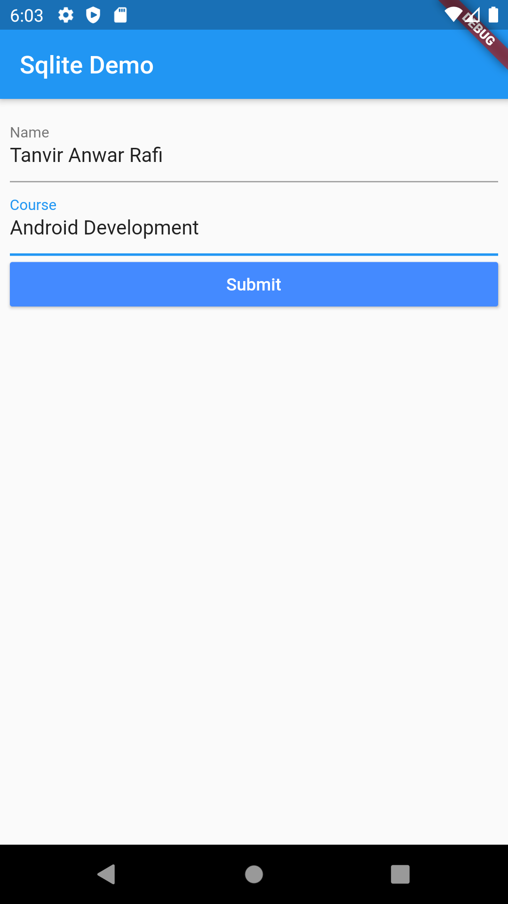
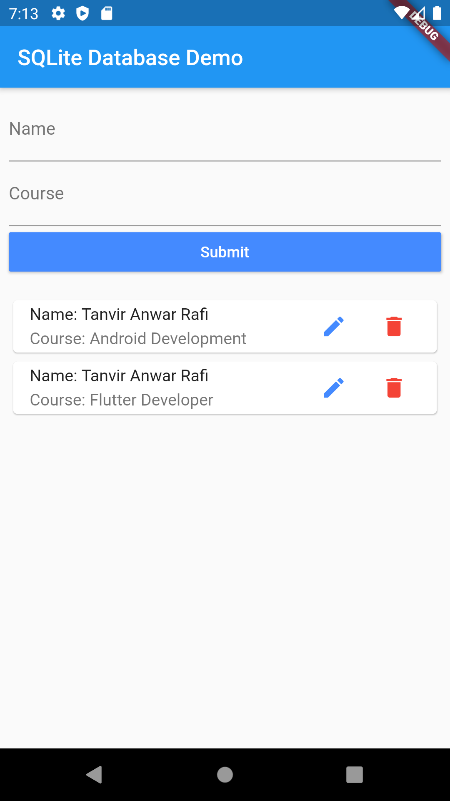

# SQLite Database

This project is for learning Flutter (Native Application Development)

### Feature : SQLite Database CRUD
 - Create Data
 - Read Data
 - Update Data
 - Delete Data
 
## Screenshots

 &nbsp;&nbsp;&nbsp;&nbsp;&nbsp;&nbsp;&nbsp;&nbsp;&nbsp;&nbsp;  
